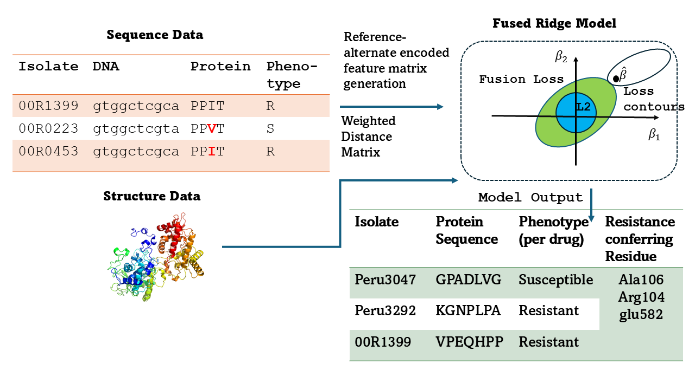

# Antibiotic Resistance Prediction with Structural Constraints

This repository provides a modular and extensible framework for predicting antibiotic resistance in *Mycobacterium tuberculosis* using genomic and protein sequence data. It includes classical and structurally informed machine learning models, utilities for data preprocessing, mutation translation, feature construction, and rigorous evaluation under data-limited settings.

---

## Project Overview

Antibiotic resistance in TB poses a major global health challenge. Existing models often rely on raw sequences or pre-trained embeddings, which may fail to capture biological constraints critical for resistance emergence. This project introduces **Fused Ridge Regression** with 3D structural priors, improving interpretability and robustness across varying data availability.

---

## Repository Structure

```
├── data/                        # Input data: FASTA, VCF-derived CSVs, distance matrices
    ├── feature_matrix_labels/      # Saved model-ready features and phenotype labels
├── utility_files/              # Python scripts for loading, preprocessing, modeling, evaluation
│   ├── data_loading.py
│   ├── data_preprocessing.py
│   ├── model_training.py
│   ├── fused_ridge_gpu.py
│   ├── distance_processing.py
│   └── evaluation.py

```

---

## Key Features

- **Protein translation and mutation handling** with support for gaps and frameshifts
- **Fused Ridge Regression** incorporating 3D distance priors between residues
- **Standard Ridge, Lasso, Logistic Regression** baselines
- **Subsampling experiments** for assessing model robustness across training sizes
- **Novel mutation generalization analysis** using deduplicated isolate data
- **Interpretability modules**: feature importance, precision-recall evaluation, coefficient-distance heatmaps

---

## Getting Started

### Requirements

- Python 3.8+
- Install dependencies:
```bash
pip install -r requirements.txt
```

### Data Preparation

Ensure the following files are available in the `data/` directory:
- Processed VCF/FASTA inputs
- Phenotype labels (`master_table_resistance.csv`, `cryptic_dataset.csv`)
- WHO mutation catalog (optional)
- 3D distance matrices from PDB structures (`distmaps/`)

---

## How to Run

### Protein Translation & Feature Generation
Run the notebook:
```bash
protein_feature_matrix_generation.ipynb
```

### Model Training & Evaluation
```bash
model_training_evaluation.ipynb
```

### Subsampling & Novelty Analysis
```bash
generalization_tests.ipynb
```

---

## Results Highlights

- Fused Ridge outperforms classical models on several genes, especially under limited data.
- Subsampling confirms generalization benefit from more samples for genes like *embB*, *inhA*.
- Novelty analysis shows substantial unseen mutation rates in test sets, affirming the value of deduplication.


## Model Training Schematic

 

---

## Future Work

- Integrate evolutionary embeddings (e.g., ESM-2, MSA Transformer) into the fused framework
- Explore uncertainty-aware models for mutation effect estimation
- Extend benchmark to more genes and multi-drug resistance scenarios

---

## Citation

If you find this work useful, please cite:

> Mahbuba Tasmin, Anna G. Green. *Beyond Sequence-Only Models: Leveraging Protein Structure for Antibiotic Resistance Prediction in Sparse Genomic Datasets.* ICLR 2025, Machine Learning for Genomics Explorations Workshop.

